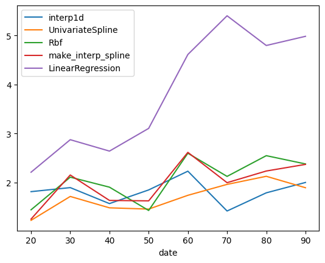
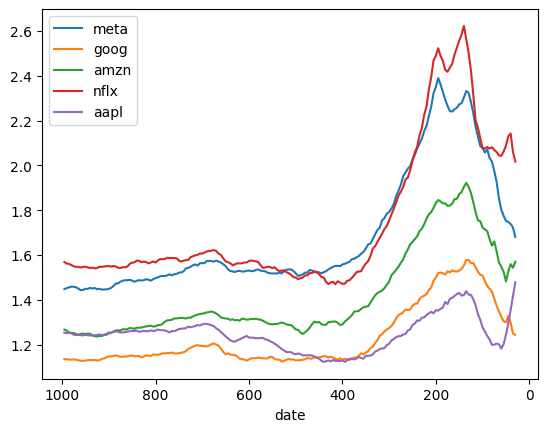

Data Science HW3
================

## [HOMEPAGE](../README.md)

## Introduction

I chose to continue using markdown for this assignment because its convenient embedded image and formula system made it easier for me to analyze and introduce code. At the same time, I don't think it is necessary to use fancy reports like liberal arts, and the focus is on content.

## Environment

Base on the last job, this time no new environment is required, the only thing changed is to install scipy and sklearn. And pull the repo to local.

```sh
$conda activate IDS
$pip install scipy
$pip install scikit-learn
$git pull git@github.com:henrytsui000/DataScienceProject.git
```

## FAANG

FAANG, which is the abbreviation of Facebook, Apple, Amazon, Netflix and Google. The common point of these companies is all of them is about technology company. Which is the most interested me combination of the stock market.

### Missing data
The most fatal thing in the dataset is missing data, which will affect the training of the model. For example, the dataloader will input nan. Usually I choose to drop missing data directly in computer vision, but this problem becomes tricky when the data becomes linear, because linear data cannot have any discontinuities.

Luckily I didn't have missing values for the stock market price I chose, the only thing being that it was closed on weekends, but I guess that's not too important.
To simulate missing data, I chose to randomly mask out a fixed percentage of the data. And supplement the data with common methods in a variety of ways.


## Masking data

The program I wrote can be found [here](../tools/fill_up.py). The first is the masking data I mentioned earlier. I choose to set a $p$ to indicate how many percent of the data I want to mask, and use np.random.choice to make a NxM matrix, containing $p％$ True.
At the same time, I think it would be a wise decision to hollow out by myself, because it can be used as a validation through masking, just like training a neural network. By knowing the outcome of each interpolation method or each interval, the decision is made which method to use.

### Code explain
nd.random.choice is the function which I mention before. Through np.ma.mask, two matrices (numeric matrix and Boolean matrix) can be given as masks to remind me which positions are missing by my simulation.
It would return:
- SD : Stock Data
- SDM : Stock Data Masked
- MASK : bool martix, which position is masked
- title : Inherit read_data, the stock names  

```python3
def mask_data(args, SD, title):
    # SDM stock_data_masked
    mask_percent = args.mask
    SD = SD.to_numpy()
    SDM = SD.copy()

    MASK = np.random.choice([True, False], size=SDM.shape, p=[mask_percent, 1-mask_percent])
    MASK[0, :] = MASK[-1, :] = False
    SDM = np.ma.masked_array(SDM, mask=MASK)
    return SD, SDM, MASK, title
```

## Definition of Loss

It is important to define an evaluation for various imputation of missing values. We know that the amount of missing data will be $fac = D\cdot p$, which $D$ is the number of days, $p$ is the mask ratio. The error of one stock is 

$Loss(stock) = \sum^{D}_{i}{SD_i-SDM_i}$

Thus the Loss function could be:

$\widehat{Loss}=\frac{Loss}{fac} = \frac{\sum^{D}_{i}{SD_i-SDM_i}}{D\cdot p}$

This formula can be used to measure whether different interpolation methods are accurate for the same stock.
But the next problems come out, there is a lot of different in each stock:
|method|meta|goog| amzn| nflx| aapl|
|-|-|-|-|-|-|
|interp1d|1400.98|449.24| 676.23|3183.65| 531.46|

The reason why is obvious, because different stocks have different bases, so there will be differences in multiples when making up the difference, and the way to solve this problem is to divide their Loss by the average of the stock price:

$\widetilde{Loss} = \frac{\widehat{Loss}}{stock_{avg}} =  \frac{\sum^{D}_{i}{SD_i-SDM_i}}{D\cdot p \cdot stock_{avg}}$

Finally, the loss of these stock is fair:
|method|meta|goog| amzn| nflx| aapl|
|-|-|-|-|-|-|
|interp1d|1.462%|1.261%| 1.636%|1.817%| 1.351%|

After defining LOSS, the structure of the experiment is roughly formed, because we know that the value of LOSS is determined according to the following reasons:
- Different stocks
- Different sampling periods
- Different sampling lengths
- Different mask ratios
- Different Interpolation Methods

Therefore, I will fix the control variable and do the following experiments to verify whether different operating variables will have reasonable results or have an impact on the Dataset.

### Code explain
Via lambda function, we can define the loss function, and the Normalization Factor(NF) could calculate by numpy function.

```python
LOSS = lambda ground, inter : np.around(np.sum(np.abs(ground-inter)), decimals = 2)
NF = np.mean(SD, axis=0)*args.date*args.mask/100
loss_table = loss_table.div(NF, axis=1)
```

## Method of Interpolation
Thanks for scipy, it extension provide me a easy way to call out interpolation function. The function call by these steps:
1. define the interpolation function by known pair(x, y).
2. Give the function which point(x) is missed.
3. Fill in the value which is predicted.


```python3
find_mask = lambda array : np.nonzero(array)[0]
def INTER(sdm, mask, func = interp1d):
    y_axis = np.delete(sdm, mask)
    interp_func = func(find_mask(~mask), y_axis)
    mask_val = interp_func(find_mask(mask))
    sdm[find_mask(mask)] = mask_val
    return np.around(sdm, decimals=2)
```

## Method of Interpolation
The first is the analysis of various interpolation methods. I compared interp1d, UnivariateSpline, Rbf, make_interp_spline, LinearRegression several methods, because linear regression has a lot of errors, so I will first list him in the chart, in the same Loss- In date, you can see that the common interpolation method such as interp1d is better, and I will introduce other interpolation methods in the next paragraphs, but I will use interp1d as the default interpolation method in the following comparisons.

The first is why Linear regression is so bad. I think this reason is very obvious, because we can't describe the data of several years with a $y=ax+b$, and it will need more polynomials to represent it. However, when we reduce the time to about 10 days, we can see that the Loss of linear regression gradually decreases, approaching other inner difference methods. As you differentiate a polynomial interval, the tangent will fit the interval better (compared to the full function).




## Risk & Mask
Next, let's discuss Risk and Mask. In the last homework, I mentioned a Risk function, which can measure the volatility and change of a stock. It is conceivable that volatility will affect the predictability of a missing stock, which will make Mask's Error larger.
So I drew two graphs, the Risk, Mask values from Day[1000:0] to Day[10:0].

||Mask Value|Risk Value|
|-|-|-|
|Figure|||

However, unlike expected they were not nearly the same, so I checked the difference. This makes me think that the volatility of stocks does not refer to the trend, that is to say, the rapid growth of stocks will also cause large volatility, but such events are actually easy to predict, because it is just an ordinary strictly increasing function.

This also explains why the mask and risk of the two stocks are sometimes very similar, and sometimes very different. Then I opened the past stock market data and confirmed the correctness of this conjecture.

## Mask Percent & Mask Loss

A very trivial property is that the higher the Mask ratio, the lower the correct rate and the higher the Loss. However, I still did an experiment to verify this. Unexpectedly, the growth rate of Loss was much lower than expected. The fact is that when the coverage rate is 50%, Loss is less than double that of 10%, which proves the linear inner difference. In fact, it is not a bad method of inner difference, and sometimes it can effectively solve the problem of missing data.


## Other works
In the last homework, I mentioned that I plan to incorporate the FAANG news into the forecasting model, so I wrote a script this week to get the daily stock market news through the API, just like updating the stock price before, I will put him In an efficient way [HW1](./HW1_109511068.pdf) written in my own data set, the detailed code can be found [here](../tools/update_new.ipynb). If the next job needs or has free time, I will finish importing it into the pretrained BERT model to calculate the statement score. The focus of this assignment is to supplement the missing data, so I will wait for the completion of the BERT encode, and then introduce my overall approach.


## Sum up / Future work
In this assignment, I hollowed out the function myself, and did experiments with different interpolation methods, different intervals, etc., which proved that linear interpolation would be a good method for interpolation. And it has the opportunity to be used for the simplest (brainless) forecasting method in stock market forecasting.

In the same paragraph as the previous paragraph, I will complete a more detailed BERT model in the future to bring NLP technology to FAANG for prediction, hoping to make the prediction results more accurate.