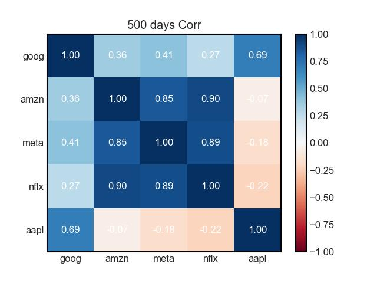

# Stock Price Prediction

# Contents

- [Stock Price Prediction](#stock-price-prediction)
- [Contents](#contents)
- [About](#about)
- [Set up environment](#set-up-environment)
- [Prepare Data](#prepare-data)
  - [Raw Data](#raw-data)
  - [Training Data](#training-data)
- [Visualize Data](#visualize-data)
  - [More Detail](#more-detail)
  - [Correlation GIF](#correlation-gif)
- [Fine Tune BERT](#fine-tune-bert)
- [Go Predict](#go-predict)
- [Experiment](#experiment)
- [Acknowledgement](#acknowledgement)

# About

This is a side project create by Lucy's and me, the main idea is use Bert model for fuse the stock news title and past stock price to predict the stock price in the future.

What we notice when investing in stocks is that in addition to observing the past values of stocks and short-term changes in stocks. We also refer to the news of the stock market, that is, we refer to the buying and selling conditions of other investors or the operating conditions of the company. This is why simple models such as LSTM or DNN will be inaccurate in stock forecasting - it loses the fundamental value of the stock.

Therefore, we hope to use bert to identify the positive or negative impact of news on stocks, that is, to use bert to solve downstream tasks. However, we are faced with a huge problem, we only have historical daily stock prices, not hourly or even minutely stock data. And representing dozens of news, their answers during training will be the same (news published within the same day).
So we thought of another method: According to the free or fetching news API on the Internet, we can get the value of each news, and use this value as the ground truth of fine-tune. In inference, the average score of all news of the day is predicted as the predicted stock market rise.

<!-- 
# Report

You can find the report in this table.

|      | HW1                              | HW2                  | HW3 | HW4 | HW5 |
| ---- | -------------------------------- | -------------------- | --- | --- | --- |
| Link | [PDF](./HWreport/HW1_109511068.pdf) | [MD](./HWreport/hw2.md) |     |     |     | -->

# Set up environment

```bash
$git clone git@github.com:henrytsui000/DataScienceProject.git
$cd $(THIS_PROJECT)
$conda create -n IDS python=3.8
$conda activate IDS
$pip install -r requirements.txt
# install pytorch, please choose your cuda version
$conda install pytorch torchvision torchaudio pytorch-cuda=11.6 -c pytorch -c nvidia
```

# Prepare Data

## Raw Data

There are two ways to get the news data and the stock price data:

1. Run the python code to get the data. You may apply an account at marketaux, and add an .env file which indicate the TOKEN

```bash
$python tools/update_data.py
$python tools/update_news.py
```

2. Use the command below to download the files which I upload to the Google Drive.

```bash
$gdown --folder https://drive.google.com/drive/folders/1WR5bq9gzMtNFHMnTB6dLEm8AeJj8b9ZT?usp=share_link
```

The file structure you downloaded is as follows:

```
./data
├── news.csv
└── stock.csv 

0 directories, 2 files
```

## Training Data

This step for transform data in news and stock to format data, easier for model reading.

```bash
$python tools/make_bert.py
$python make_regression.py
```

# Visualize Data

### [More Detail](visulize/README.md)

## Correlation GIF



# Fine Tune BERT

# Go Predict

# Experiment

# Acknowledgement

This visiulize source code is based on FFN, Numpy, Pandas. Thanks for their wonderful works.

The code for predict stock news is based on BERT, Thanks for GOOGLE.
