# DataScienceProject

This is a project about my data science course, the main idea is a AI model through fuse the stock news title and past stock price to predict the stock price in the future.

# Report

You can find the report in this table.

|      | HW1                              | HW2                  | HW3 | HW4 | HW5 |
| ---- | -------------------------------- | -------------------- | --- | --- | --- |
| Link | [PDF](./HWreport/HW1_109511068.pdf) | [MD](./HWreport/hw2.md) |     |     |     |

# Set up environment

```bash
$git clone git@github.com:henrytsui000/DataScienceProject.git
$cd $THIS_PROJECT
$conda create -n IDS python=3.8
$conda activate IDS
$pip install -r requirements.txt
```

# Prepare Data

There are two ways to get the news data and the stock price data:

1. Run the python code to get the data. Your may apply an account at marketaux, and add a .env file which indicate the TOKEN

```bash
$python tools/update_data.py
$python tools/update_news.py
```

2. Download the files which I upload to the Google Drive.

```bash
$gdown ${news.csv}
$gdown ${price.csv}
```

And make the file like this:

```
./data
├── News
│   ├── FAANG_STOCK_NEWS.csv
│   └── news.csv
└── Stock
    └── stock.csv

2 directories, 3 files
```

# Visualize Data

## Mask Data
It is important to define an evaluation for various imputation of missing values. We know that the amount of missing data will be $fac = D\cdot p$, which $D$ is the number of days, $p$ is the mask ratio. The error of one stock is

$Loss(stock) = \sum^{D}_{i}{SD_i-SDM_i}$

Thus the Loss function could be:

$\widehat{Loss}=\frac{Loss}{fac} = \frac{\sum^{D}_{i}{SD_i-SDM_i}}{D\cdot p}$

$\widetilde{Loss} = \frac{\widehat{Loss}}{stock_{avg}} =  \frac{\sum^{D}_{i}{SD_i-SDM_i}}{D\cdot p \cdot stock_{avg}}$

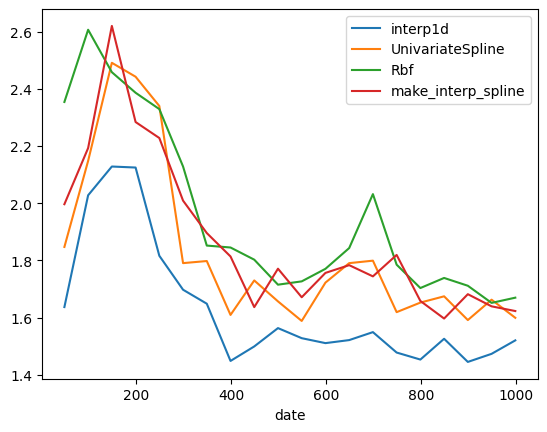

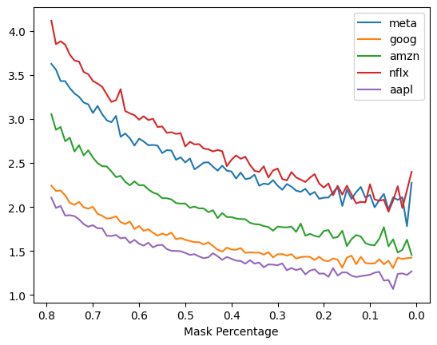


Finally, the loss of these stock is fair:

| method   | meta   | goog   | amzn   | nflx   | aapl   |
| -------- | ------ | ------ | ------ | ------ | ------ |
| interp1d | 1.462% | 1.261% | 1.636% | 1.817% | 1.351% |

```python
LOSS = lambda ground, inter : np.around(np.sum(np.abs(ground-inter)), decimals = 2)
NF = np.mean(SD, axis=0)*args.date*args.mask/100
loss_table = loss_table.div(NF, axis=1)
```
## Price
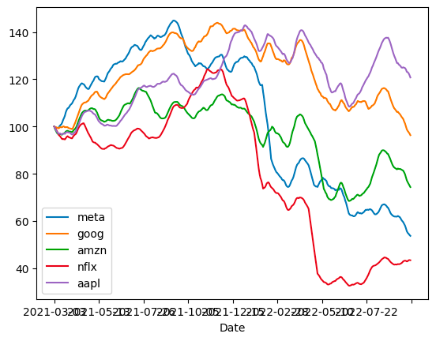
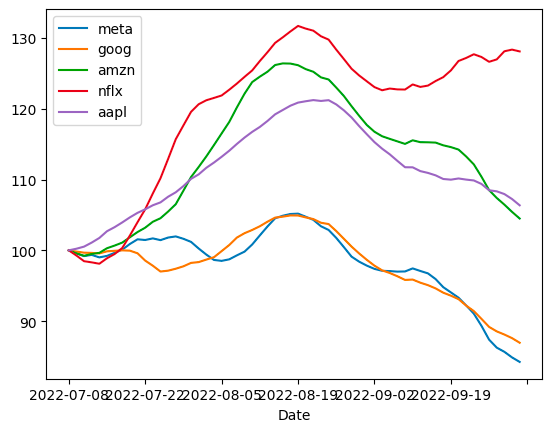

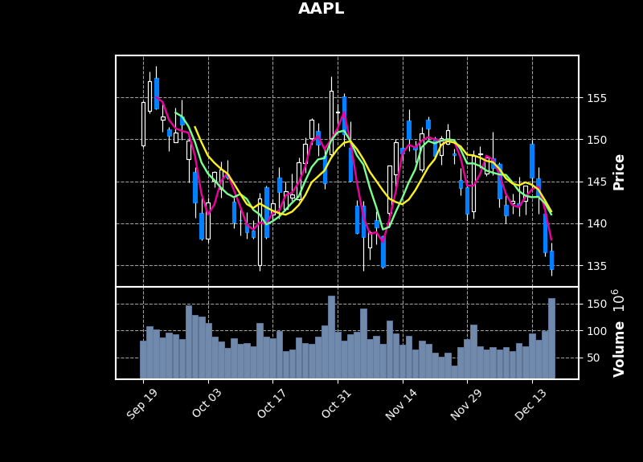
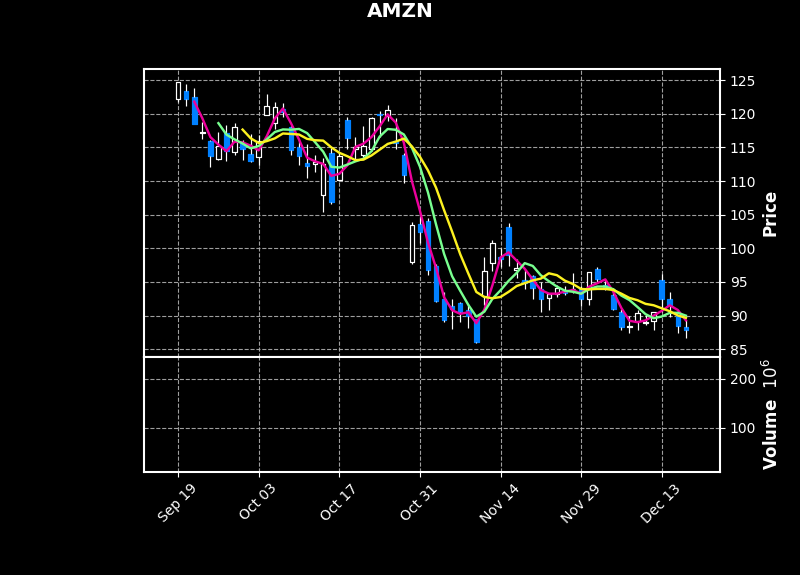
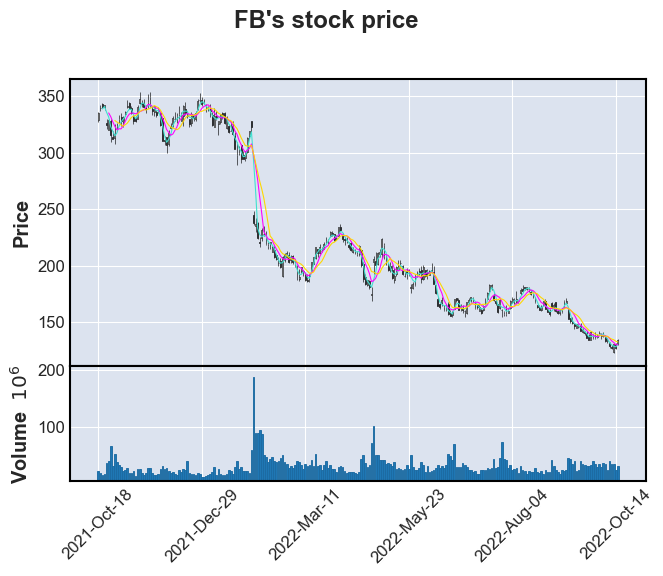
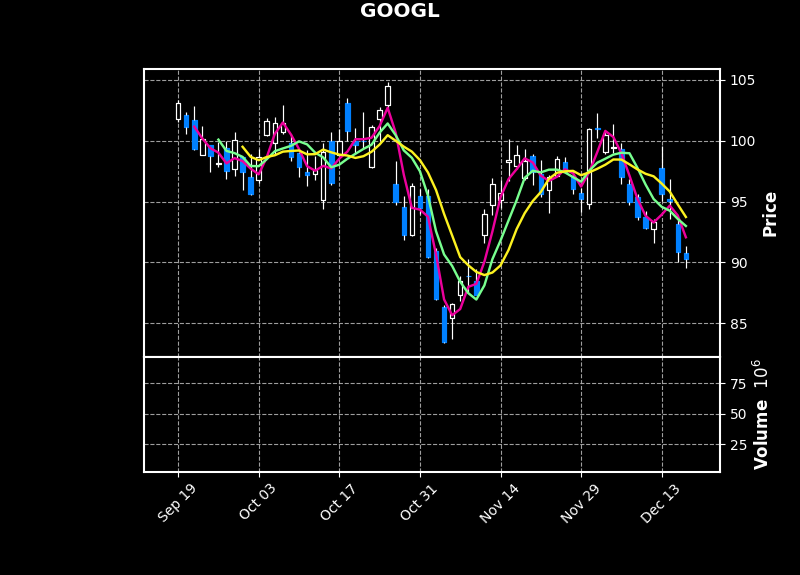
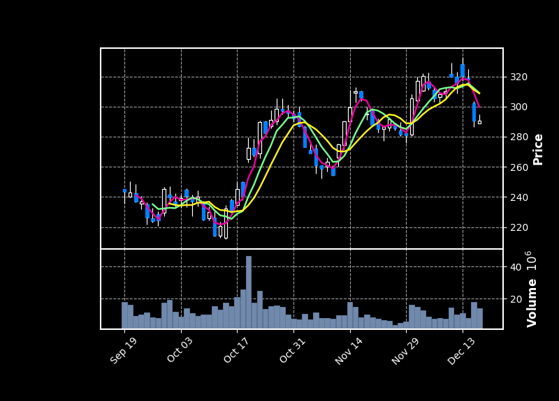


## News
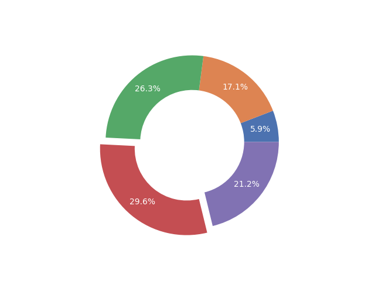
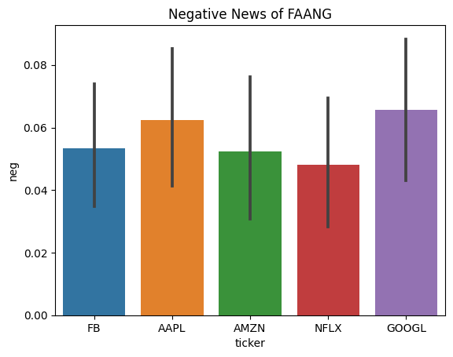


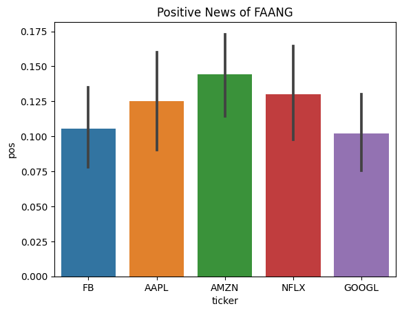


## Correlation GIF


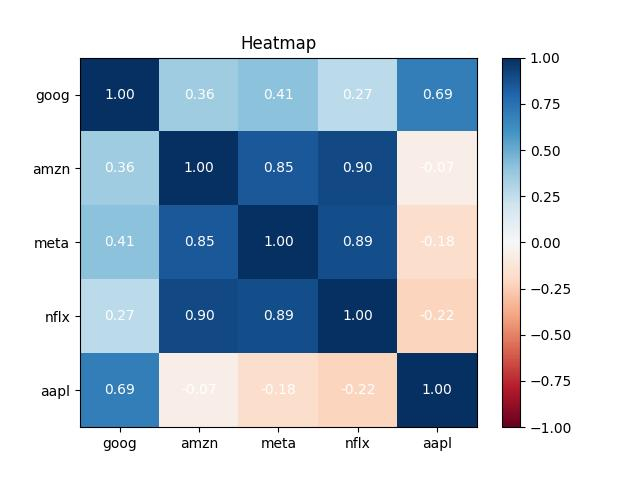

```bash
$python correlation_gif.py
```

# Experiment

# Acknowledgement

This source code is based on FFN, Numpy, Pandas. Thanks for their wonderful works.
